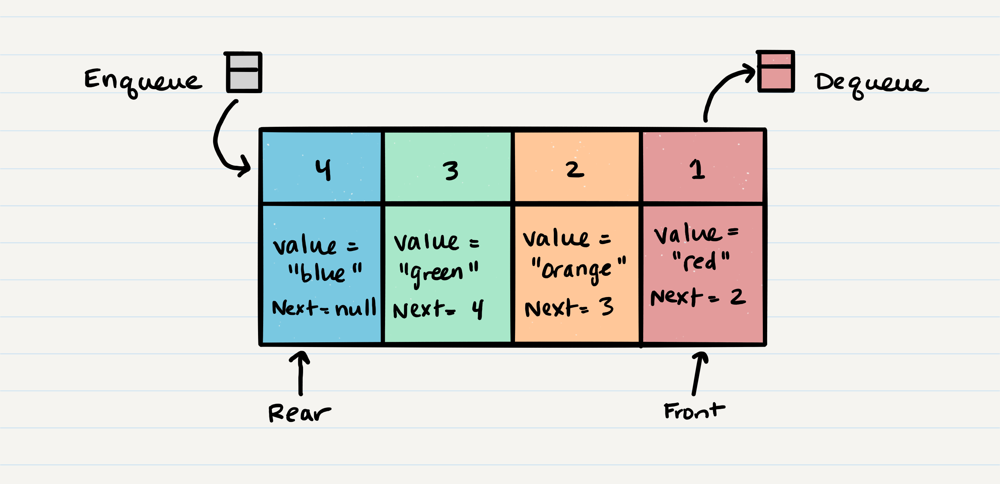

# CLASS 10 NOTES - Implementation: Stacks and Queues

[https://codefellows.github.io/common_curriculum/data_structures_and_algorithms/Code_401/class-10/resources/stacks_and_queues.html](https://codefellows.github.io/common_curriculum/data_structures_and_algorithms/Code_401/class-10/resources/stacks_and_queues.html)

- - -

## **What is a Stack?**

- A data structure made up of Nodes each of which references the next Node in the stack, but not the previous.

### FILO - First In Last Out

- First item added in the stack will be the last item popped out of the stack.

### LIFO - Last In First Out

- Last item added to the stack will be the first item popped out of the stack.

### Stack Visualization

- When you push something to the stack, it becomes the new `top`. When you pop something from the stack, you pop the *current* `top` and set the *next* `top` as `top.next`.


### Push O(1)

- will take the same amount of time no matter how many Nodes `(n)` you have in the stack.

```js
ALOGORITHM push(value)
// INPUT <-- value to add, wrapped in Node internally
// OUTPUT <-- none
   node = new Node(value)
   node.next <-- Top
   top <-- Node
```

### PopO(1)

- Top Node will be re-assigned to the Node that lives below, top Node is returned to the user.
  - Check `isEmpty` before conducting a `pop`.
  - You can also wrap the call in a try/catch block.
- You have to create a reference named `temp` that points to the same Node that top points to.

```js
ALGORITHM pop()
// INPUT <-- No input
// OUTPUT <-- value of top Node in stack
// EXCEPTION if stack is empty

   Node temp <-- top
   top <-- top.next
   temp.next <-- null
   return temp.value
```

### Peek O(1)

- Inspecting the top Node of the stack.
  - Check `isEmpty` before conducting a `peek`.
  - You can also wrap the call in a try/catch block.
- We do not re-assign the `next` property when we `peek` to keep reference to `next` Node in the stack.
  - Allows `top` to stay `top` until we decide to `pop`.

### IsEmpty O(1)

```js
ALGORITHM isEmpty()
// INPUT <-- none
// OUTPUT <-- boolean

return top = NULL
```

## **What is a Queue?**

- *Enqueue* - Nodes or items added.
- *Dequeue* - Nodes or items removed.
  - If called when queue is empty, exception will be raised.
- *Front* - Front/first Node of  queue.
- *Rear* - Rear/last Node of the queue.
- *Peek* - View the value of front Node.
  - If called when queue is empty, exception will be raised.
- *IsEmpty* - returns true when queue is empty, otherwise returns false.

### FIFO - First In First Out

### LILO - Last In Last Out

### Queue Visualization



### Enqueue O(1)

- Done with O(1) operation in time
  - Takes same amount of time to perform the operation regardless of how many other items live in queue.

```js
ALGORITHM enqueue(value)
// INPUT <-- value to add to queue (will be wrapped in Node internally)
// OUTPUT <-- none
   node = new Node(value)
   rear.next <-- node
   rear <-- node
```

### Dequeue O(1)

- Always just removing the front Node of the queue
  - Check `isEmpty` before conducting a `dequeue`.
  - You can also wrap the call in a try/catch block.
- You have to create a `temp` reference that points to the same Node that `front` points to, or `Node 1`.

```js
ALGORITHM dequeue()
// INPUT <-- none
// OUTPUT <-- value of the removed Node
// EXCEPTION if queue is empty

   Node temp <-- front
   front <-- front.next
   temp.next <-- null

   return temp.value
```

### Peek O(1)

- Only inspecting `front` Node of the queue
  - Again, Check `isEmpty` before conducting a `peek`.
  - You can also wrap the call in a try/catch block.
- Similar to stacks, only using `front` in place of `top`.
- Do not re-assign `next`
  - We want to keep reference to next Node in queue.
  - Allows `front` to stay in `front` until we decide to `dequeue`.

### IsEmpty O(1)

- Same as a stack, only using `front` in place of `top`.

- - -

[back](../README.md)
